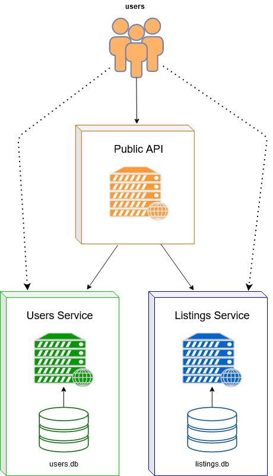

# Backend Tech Challenge
An exercise to assess your skills with Python, [Tornado](http://tornadoweb.org/) (Web Framework), writing non-blocking/asynchronous code, and microservices architecture.

## Introduction
We're building a system that stores information about users and properties that are available to rent or buy. The system is designed as a set of small web applications that each perform a specific task (otherwise known as "microservices").

Please read [the Wikipedia article about microservices](https://en.wikipedia.org/wiki/Microservices) if you are not familar with the architecture before.

Some parts of the system have been built already. We need to your help to complete the rest!

### Architecture
This system comprises of 3 independent web applications:

- **Listing service:** Stores all the information about properties that are available to rent and buy
- **User service:** Stores information about all the users in the system
- **Public API layer:** Set of APIs that are exposed to the web/public

The listing service and user service are backed by relevant databases to persist data. The services are essentially a wrapper around their respective databases to manipulate the data stored in them. For this reason, the services are not intended to be directly accessible by any external client/application.

Services are free to store the data in any format they wish (in a SQL table, or as a document in a NoSQL db, etc.). The only requirement is for them to expose a set of REST APIs that return data in a standardised JSON format. Services are the guardians/gatekeepers for their respective databases. **Any other application/service that wishes to access the data must go solely through the REST APIs exposed by the service. It cannot access the data directly from the database at any cost.**

How does the mobile app or user-facing website access the data in the system? This is where the public API layer comes in. The public API layer is a web application that contains APIs that can be called by external clients/applications. This web application is responsible for interacting with the listing/user service through its APIs to pull out the relevant data and return it to the external caller in the appropriate format.

### 1) Listing Service
The listing service stores information about properties that are available to rent or buy. These are the fields available in a listing object:

- `id (int)`: Listing ID _(auto-generated)_
- `user_id (int)`: ID of the user who created the listing _(required)_
- `price (int)`: Price of the listing. Should be above zero _(required)_
- `listing_type (str)`: Type of the listing. `rent` or `sale` _(required)_
- `created_at (int)`: Created at timestamp. In microseconds _(auto-generated)_
- `updated_at (int)`: Updated at timestamp. In microseconds _(auto-generated)_

#### APIs
##### Get all listings
Returns all the listings available in the db (sorted in descending order of creation date). Callers can use `page_num` and `page_size` to paginate through all the listings available. Optionally, you can specify a `user_id` to only retrieve listings created by that user.

```
URL: GET /listings

Parameters:
page_num = int # Default = 1
page_size = int # Default = 10
user_id = str # Optional. Will only return listings by this user if specified
```
```json
Response:
{
    "result": true,
    "listings": [
        {
            "id": 1,
            "user_id": 1,
            "listing_type": "rent",
            "price": 6000,
            "created_at": 1475820997000000,
            "updated_at": 1475820997000000,
        }
    ]
}
```

##### Create listing
```
URL: POST /listings
Content-Type: application/x-www-form-urlencoded

Parameters: (All parameters are required)
user_id = int
listing_type = str
price = int
```
```json
Response:
{
    "result": true,
    "listing": {
        "id": 1,
        "user_id": 1,
        "listing_type": "rent",
        "price": 6000,
        "created_at": 1475820997000000,
        "updated_at": 1475820997000000,
    }
}
```

### 2) User Service
The user service stores information about all the users on the system. Fields available in the user object:

- `id (int)`: User ID _(auto-generated)_
- `name (str)`: Full name of the user _(required)_
- `created_at (int)`: Created at timestamp. In microseconds _(auto-generated)_
- `updated_at (int)`: Updated at timestamp. In microseconds _(auto-generated)_

#### APIs
##### Get all users
Returns all the users available in the db (sorted in descending order of creation date).

```
URL: GET /users

Parameters:
page_num = int # Default = 1
page_size = int # Default = 10
```
```json
Response:
{
    "result": true,
    "users": [
        {
            "id": 1,
            "name": "Suresh Subramaniam",
            "created_at": 1475820997000000,
            "updated_at": 1475820997000000,
        }
    ]
}
```

##### Get specific user
Retrieve a user by ID
```
URL: GET /users/{id}
```
```json
Response:
{
    "result": true,
    "user": {
        "id": 1,
        "name": "Suresh Subramaniam",
        "created_at": 1475820997000000,
        "updated_at": 1475820997000000,
    }
}
```

##### Create user
```
URL: POST /users
Content-Type: application/x-www-form-urlencoded

Parameters: (All parameters are required)
name = str
```
```json
Response:
{
    "result": true,
    "user": {
        "id": 1,
        "name": "Suresh Subramaniam",
        "created_at": 1475820997000000,
        "updated_at": 1475820997000000,
    }
}
```

### 3) Public APIs
These are the public facing APIs that can be called by external clients such as mobile applications or the user facing website.

##### Get listings
Get all the listings available in the system (sorted in descending order of creation date). Callers can use `page_num` and `page_size` to paginate through all the listings available. Optionally, you can specify a `user_id` to only retrieve listings created by that user.

```
URL: GET /public-api/listings

Parameters:
page_num = int # Default = 1
page_size = int # Default = 10
user_id = str # Optional
```
```json
{
    "result": true,
    "listings": [
        {
            "id": 1,
            "listing_type": "rent",
            "price": 6000,
            "created_at": 1475820997000000,
            "updated_at": 1475820997000000,
            "user": {
                "id": 1,
                "name": "Suresh Subramaniam",
                "created_at": 1475820997000000,
                "updated_at": 1475820997000000,
            },
        }
    ]
}

```

##### Create user
```
URL: POST /public-api/users
Content-Type: application/json
```
```json
Request body: (JSON body)
{
    "name": "Lorel Ipsum"
}
```
```json
Response:
{
    "user": {
        "id": 1,
        "name": "Lorel Ipsum",
        "created_at": 1475820997000000,
        "updated_at": 1475820997000000,
    }
}
```

##### Create listing
```
URL: POST /public-api/listings
Content-Type: application/json
```
```json
Request body: (JSON body)
{
    "user_id": 1,
    "listing_type": "rent",
    "price": 6000
}
```
```json
Response:
{
    "listing": {
        "id": 143,
        "user_id": 1,
        "listing_type": "rent",
        "price": 6000,
        "created_at": 1475820997000000,
        "updated_at": 1475820997000000,
    }
}
```


# Write-up: Ivan Andika Lie

### Microservice Architecture and Explanations

The microservice architecture consists of three services: Listing Service, User Service, and Public-API Service which is stored under `/services` directory. The diagram of the architecture is illustrated below:



Ideally, users should only access services through the Public-API endpoints. However, due to challenge requirements, users may send HTTP requests to both Users Service API and Listings Service API. Both Users Service and Listings Service have their own database that can only be accessed by the service it is attached to. For example, Public API Service must not access users.db and listings.db directly. Instead, it needs to interact with the services' API instead. 

However, this poses additional complexities when queriying joined data. Since databases are only isolated to their respective service, if we want to get data that requires joins between users.db and listings.db. We need to call each service's API to get data from each of the database and join them manually. For example the call to `GET /public-api/listings` requires us to fetch all the queried listings from Listings Service first, before we fetch the user for each of the listing.

Nevertheless, microservice architecture has benefits in building indepedent components that can be independently deployable and scalable, with each service having firm module boundary. Hence, any change in one service would not adversely affect other services (unlike monolith architecture). Moreover, each development team takes full responsibility of service they are in charge of over its full life time, compared to project-based approach where a project team is disbanded when the project has been completed.


## Updated Setup
We will be using Python 3 for this exercise.

### Install pip
pip is a handy tool to install libraries/dependencies for your python programs. pip should already come installed on your system. Head over to https://pip.pypa.io/en/stable/installing/ for steps to install pip if it's not available.

### Install virtualenv
We use virtualenv to create an isolated running environment to install dependencies and launch the web application. Head over to https://virtualenv.pypa.io/en/stable/installation/ for instructions to install virtualenv.

### Install Docker and Docker Compose (Optional)
Docker and Docker Compose would be used as one of two ways to start the application. It provides easier setup for the user. Head over to https://docs.docker.com/get-docker/ for docker installation and https://docs.docker.com/compose/install/ to for Docker Compose Installation.

The instruction to run the Docker commands will be explained later.

### Install dependencies
Once you have pip and virtualenv set up, we can proceed to create the environment to run our web applications:

```bash
# Locate the path for the Python 3 installation
which python3

# Create the virtual environment in a folder named "env" in the current directory
virtualenv env --python=<path_to_python_3>

# Start the virtual environment
source env/bin/activate

# Install the required dependencies/libraries
pip install -r python-libs.txt
```
You'll see `(env)` show up at the beginning of the command line if you've started virtual environment successfully. To check if the dependencies are installed correctly, run `pip freeze` and check if the output looks something like this:

```
backports-abc==0.4
tornado==4.4.2
```

# Running the application

## Initialize database

We will populate the database with random data that is generated using the script `initialize_data.py`. To run the script, go to the root project directory and run the command below:

For windows users, run the python file directly:
```bash
# Initialize the database and populate the listings and users database
python initialize_data.py
```

For Linux or iOS, run the bash script with the same name:
```bash
# Initialize the database and populate the listings and users database
sh initialize_data.sh
```

There are two ways to run the application:
1. Running the services manually 
2. Docker and Docker Compose 

We will explore how to start the services in both approaches.

## 1. Running the services manually

Each service needs to be run in separate terminal.

### Run the listing service
When we are at the project root directory, run the command below:

```bash
# Run the listing service
python ./services/listings/listing_service.py --port=6000 --debug=true
```
The following settings that can be configured via command-line arguments when starting the app:

- `port`: The port number to run the application on (default: `6000`)
- `debug`: Runs the application in debug mode. Applications running in debug mode will automatically reload in response to file changes. (default: `true`)

### Run the user service
When we are at the project root directory, run the command below:

```bash
# Run the users service
python ./services/users/user_service.py --port=8000 --debug=true
```
The following settings that can be configured via command-line arguments when starting the app:

- `port`: The port number to run the application on (default: `8000`)
- `debug`: Runs the application in debug mode. Applications running in debug mode will automatically reload in response to file changes. (default: `true`)

### Run the public API service
> Public API Service assumes that Listings Service is hosted on port 6000 and Users Service is hosted on port 8000.

When we are at the project root directory, run the command below:

```bash
# Run the public API service
python ./services/public-api/public-api.py --port=7000 --debug=true
```
The following settings that can be configured via command-line arguments when starting the app:

- `port`: The port number to run the application on (default: `7000`)
- `debug`: Runs the application in debug mode. Applications running in debug mode will automatically reload in response to file changes. (default: `true`)

The services have been set up and we can submit HTTP request using `curl` command or other means (applications such as Postman)

## 2. Docker and Docker Compose

Docker provides an containerization technology that allows us to run the same application in an isolated environment which is not affected by the host OS configuration, but still faster than virtual machine. Docker Compose is a tool for defining and running multi-container Docker applications. With Compose, we can use a YAML file to configure the applciation's services and start them in one go.

Under `/services` directory, each service has its own directory. Inside each service's directory, there is a Dockerfile that describes how to configure a container to run the specific service. In the project root directory, `docker-compose.yml` file is provided and contains configurations about the services and how they are organized inside a isolated network.

> Remember to use `sudo` before the commands for UNIX-based OS

To build the application simply run the command in the project root directory (need to wait a while):

`docker-compose build`

We can then run the application using this command:

`docker-compose up`

Check whether all three services are `Up` using this command:

`docker-compose ps`

To check the logs written by the services, use this command:

`docker-compose logs`

`docker-compose logs <service name>`

To follow the logs:

`docker-compose logs -f` 

The services have been set up and we can submit HTTP request using `curl` command or other means (applications such as Postman)

### If something went wrong...

If the `State` of the services are not `Up`, we can first stop and remove the containers by running commands:

`docker-compose stop`

`docker-compose rm`

`docker system prune -a`

`docker-compose build`

`docker-compose up`

And try to access the services

## Resources
Useful resources to help you get started:

- Tornado web application framework: http://www.tornadoweb.org/en/stable/
- Writing async code in Tornado: http://www.tornadoweb.org/en/stable/coroutine.html

Further reading:

- Python generators & the `yield` statement: https://jeffknupp.com/blog/2013/04/07/improve-your-python-yield-and-generators-explained/
